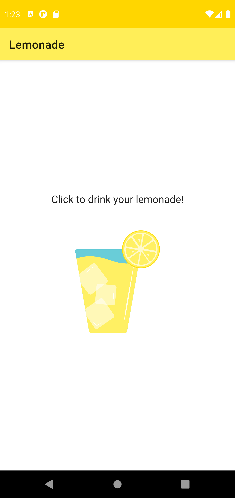

Project: Lemonade App
==================================

[Android Basics in Kotlin](https://developer.android.com/courses/android-basics-kotlin/course)

Welcome to Project: Lemonade app!

The goal is to create a simple, interactive mobile app that allows you to juice lemons until you have a glass of lemonade. Consider it a metaphor, or maybe just a fun way to pass the time!

